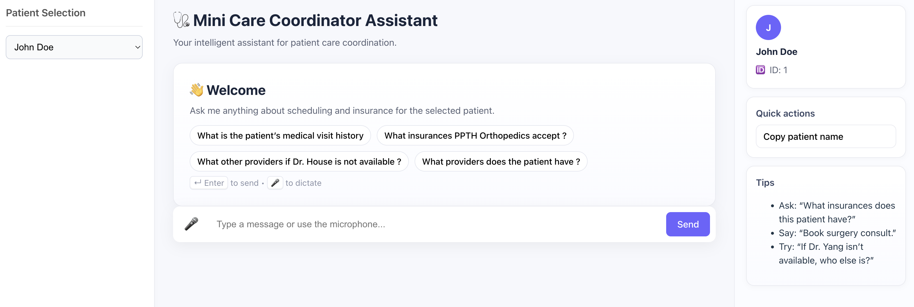

# Care Coordinator Assistant

This project is an intelligent assistant designed to help nurses with patient appointment booking and contextual Q&A, powered by a Large Language Model (LLM).



## Architecture

The project follows a modern, decoupled architecture:

- **Frontend**: A React application built with Vite, running in its own Docker container.
- **Backend**: A Python Flask application served via Docker, providing APIs for patient data, chat, and other services.
- **Database**: SQLite for relational patient data and ChromaDB for vector storage (RAG).
- **Orchestration**: Docker Compose is used to build, run, and network all services for a seamless one-command startup.
- **AI Services**: Utilizes OpenAI for LLM-powered chat (GPT-4o-mini), voice transcription (Whisper), and speech synthesis (TTS).

## Prerequisites

- Docker and Docker Compose
- An OpenAI API Key

## How to Run the Project

The entire application stack (frontend and backend) is containerized and can be launched with a single command.

### 1. Environment Setup

In the root directory of the project, create a file named `.env`. This file will store your secret API key.

Add your OpenAI API key to this file:

```
OPENAI_API_KEY=sk-your-openai-api-key-here
```
> **Note**: The `.gitignore` file is configured to ignore `.env` files, so your key will not be committed to version control.

### 2. Build and Run

From the root directory of the project, run the following command:

```bash
docker-compose up --build
```

This command will:
1. Build the Docker images for both the frontend and backend services.
2. Start the containers.
3. Initialize the backend database with sample patient data on the first run.

### 3. Access the Application

- **Frontend UI**: Open your web browser and navigate to http://localhost:5173
- **Backend API**: The API is accessible at http://localhost:5000

## API Endpoints

- `GET /patients`: Returns a summary list of all patients.
- `GET /patient/<id>`: Returns detailed data for a specific patient.
- `POST /chat`: The main endpoint for interacting with the assistant.
  - **Body**: `{ "prompt": "your question", "patient_id": 1 }`
- `POST /transcribe`: Transcribes an audio file.
- `POST /synthesize-speech`: Converts text to speech.

## Data Management and Seeding

This project uses a set of 5 sample patients for demonstration purposes. On the first launch, the backend service automatically seeds the SQLite database with this data from the `backend/patient_sheet.json` file.

For this Proof of Concept (POC), patient data is static. A production-ready application would ideally include a user interface for adding, editing, and managing patients dynamically.

## Project Structure

The project is organized as a monorepo with distinct frontend and backend directories:

```
MLChallenge/
├── backend/         # All backend code and Docker configurations
│   ├── src/         # Main source code for the Flask application
│   │   ├── api/     # Defines the Flask app factory, routes, and DB
│   │   └── core/    # Contains core business logic (e.g., CareDataManager)
│   └── ...
├── frontend/        # All frontend React/Vite code
│   └── ...
├── docker-compose.yml # Main orchestration file to run all services
└── README.md        # This file
```